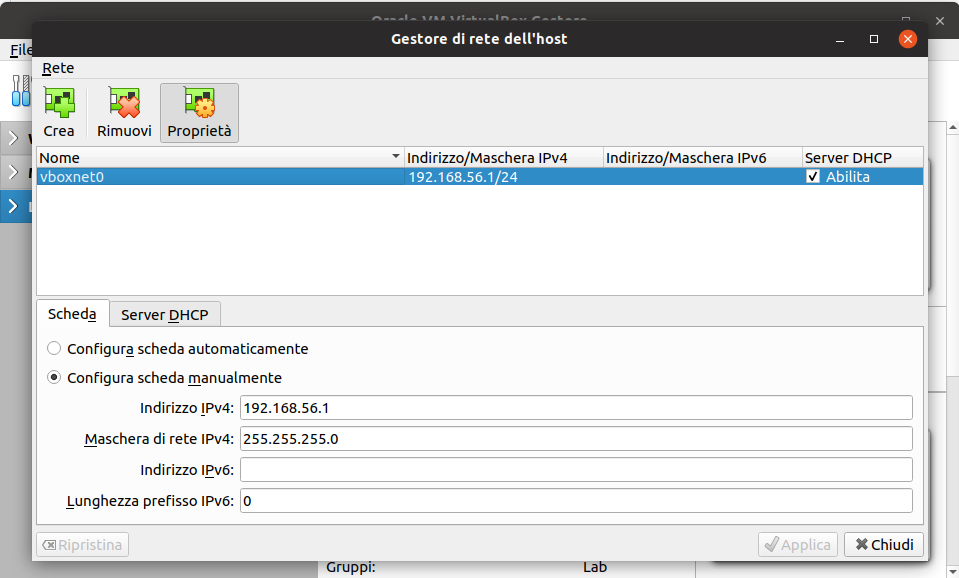
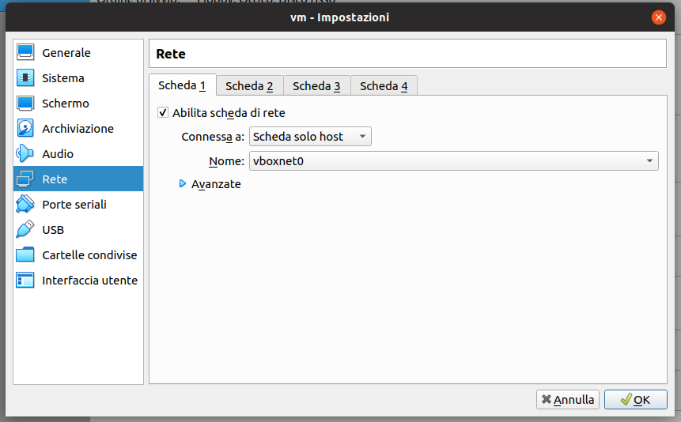

# CTF di Cyber Saiyan

## Aperitech - 29 Gennaio 2020
Durante [l'aperitech del 29 Gennaio 2020](https://community.codemotion.com/cyber-saiyan/meetups/meetup-aperitech-roma-di-cyber-saiyan) si è giocato con Shopper, la macchina boot2root preparata da HackTheBox per la [CTF di #RomHack2019](https://2019.romhack.io/ctf-2019.html)

### Writeup
[Qui è disponibile](writeup-20200129/ctf-writeup.md) il writeup della CTF

### Download OVA
Scaricare l'applicazione virtuale OVA compressa con password (file: *Shopper.ova.7z* | dimesione: 3.07GB | md5sum: *e31386b5113bc454314aaa6950faf2dd*)
* [mega.nz](https://mega.nz/#!SuAi0aAI!rAkUHGFmjGv4-yw1svS5iJ5CTty77EWsNIYrDChHDpQ)

Password del file 7z: **e7dc90616e4612d17a8ff5f7f47d23a6**

## Aperitech - 27 Maggio 2019
Durante il [secondo Aperitech di Cyber Saiyan a Roma](https://www.eventbrite.it/e/biglietti-secondo-appuntamento-con-le-ctf-aperitech-di-cyber-saiyan-60310700930) abbiamo giocato una CTF preparata da Alberto *yuntao* Caponi

### Live video
E' possibile [rivedere la soluzione della box](https://youtu.be/sLuA1Phi4mg?t=575) fatta da yuntao

### Writeup
[Qui è disponibile](writeup-20190527/ctf-writeup.md) il writeup della CTF

### Download OVA
Scaricare l'applicazione virtuale OVA zippata (file: *Aperitech_May27.zip* | dimesione: 5.28GB | md5sum: *034a40a6297d5cf8825a9ef674241c80*)
* [mega.nz](https://mega.nz/#!bAoBzY7T!Y0HTuOPgjzW092TfUw4fskNyxdAl4steg0n_jyyM9-M) 

Password per lo zip: **CyberSaiyanCTF1!1!2705**

## Compe importare il file OVA in VirtualBox
Di seguito le istruzioni per importare il file OVA in VirtualBox
* installare VirtualBox sul proprio PC ([download](https://www.virtualbox.org/wiki/Downloads))
* estrarre dallo zip il file *.ova* usando la password fornita
* importare l'applicazione virtuale in Virtualbox (*File*->*Importa applicazione virtuale...* oppure *CTRL+I*) lasciando le impostazioni di default
* verificare dal menu *File*->*Gestore di rete dell'host...* (oppure *CTRL+H*), icona *Proprietà*, la presenza di almeno una rete host con DHCP abilitato. Tale rete è necessaria a raggiungere la VM guest dalla nostra macchina host (la defaul network per la rete *vboxnet0* è 192.168.56.0/24). Se non è presente nessuna rete crearne una cliccando sul tasto destro *Crea...*, assicurarsi che il DHCP sia abilitato (la VM prenderà l'indirizzo in DHCP)

* verificare da *Impostazioni*->*Rete* della VM importata che sia abilitata la *Scheda 1* e l'opzione *Connessa a:* sia impostata a *Scheda solo host* (*Nome*: *vboxnet0*)

Avviare la VM, che prenderà un IP nel pool DHCP 192.168.56.0/24, ed iniziare a giocare :)
